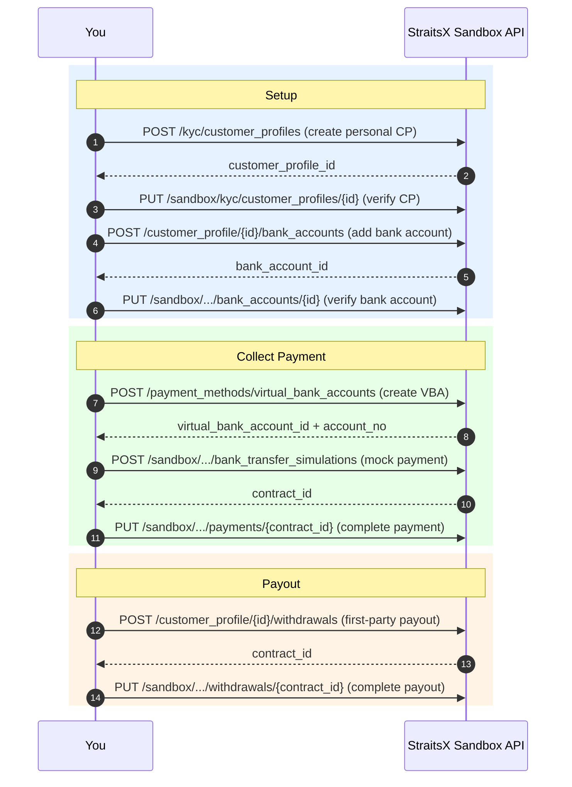
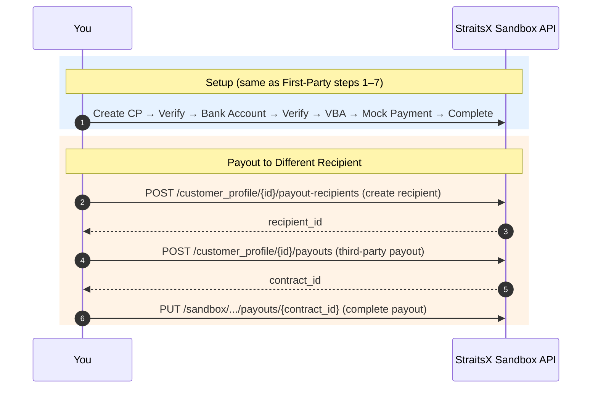
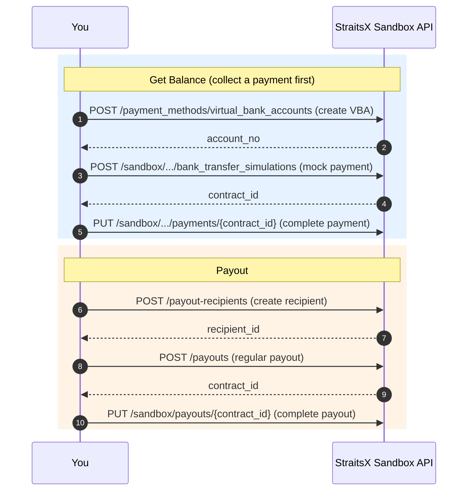

# StraitsX Sandbox Testing

## Invoke This Skill When

- User asks "How do I test the full flow?" or "Walk me through sandbox integration"
- User wants to try the API end-to-end in sandbox
- User asks about mock payments, simulating bank transfers, or testing payouts
- User is new to StraitsX and wants a working example

## Prerequisites

- Sandbox API key configured (see the `straitsx-auth-setup` skill)
- `X_XFERS_APP_API_KEY` environment variable set with a sandbox key

## Step 1: Ask the User's Integration Model

Before generating code, ask which model they need:

| Model | Use case | What it covers |
|---|---|---|
| **First-Party** | Collect payment from a customer, pay out to the same bank account | CP → Bank Account → VBA → Mock Payment → First-Party Payout |
| **Third-Party** | Collect payment from a customer, pay out to a different recipient | CP → Bank Account → VBA → Mock Payment → Payout Recipient → Third-Party Payout |
| **Regular** | Send money from your business account to any recipient | VBA → Mock Payment → Payout Recipient → Regular Payout |

If the user doesn't specify, default to **First-Party** as it's the most common starting point.

## Step 2: Generate the Flow

Generate a complete, runnable script in the user's preferred language (default to Python if not specified). The script should be sequential — each step depends on the previous one.

### First-Party Flow



```
1. Create a personal customer profile
   POST /kyc/customer_profiles

2. [Sandbox] Verify the customer profile
   PUT /sandbox/kyc/customer_profiles/{customer_profile_id}
   Body: { "data": { "attributes": { "verificationStatus": "verified" } } }

3. Create a customer profile bank account
   POST /customer_profile/{customer_profile_id}/bank_accounts

4. [Sandbox] Verify the bank account
   PUT /sandbox/customer_profile/{customer_profile_id}/bank_accounts/{bank_account_id}
   Body: { "data": { "attributes": { "status": "verified" } } }

5. Create a virtual bank account (VBA) for the customer profile
   POST /payment_methods/virtual_bank_accounts

6. [Sandbox] Simulate a bank transfer payment to the VBA
   POST /sandbox/customer_profile/{customer_profile_id}/bank_transfer_simulations
   (Include amount and the VBA account number)

7. [Sandbox] Complete the mock payment
   PUT /sandbox/customer_profile/{customer_profile_id}/payments/{contract_id}
   Body: { "data": { "attributes": { "status": "completed" } } }

8. Create a first-party payout (withdraw to the same bank account)
   POST /customer_profile/{customer_profile_id}/withdrawals

9. [Sandbox] Complete the mock payout
   PUT /sandbox/customer_profile/{customer_profile_id}/withdrawals/{contract_id}
   Body: { "data": { "attributes": { "status": "completed" } } }
```

### Third-Party Flow



```
Steps 1–7: Same as First-Party Flow

8. Create a payout recipient for the customer profile
   POST /customer_profile/{customer_profile_id}/payout-recipients

9. Create a third-party payout
   POST /customer_profile/{customer_profile_id}/payouts

10. [Sandbox] Complete the mock payout
    PUT /sandbox/customer_profile/{customer_profile_id}/payouts/{contract_id}
    Body: { "data": { "attributes": { "status": "completed" } } }
```

### Regular Flow



```
1. Create a virtual bank account (to collect a payment and get balance)
   POST /payment_methods/virtual_bank_accounts

2. [Sandbox] Simulate a bank transfer payment
   POST /sandbox/virtual_bank_accounts/bank_transfer_simulation

3. [Sandbox] Complete the mock payment
   PUT /sandbox/payments/{contract_id}
   Body: { "data": { "attributes": { "status": "completed" } } }

4. Create a payout recipient
   POST /payout-recipients

5. Create a regular payout
   POST /payouts

6. [Sandbox] Complete the mock payout
   PUT /sandbox/payouts/{contract_id}
   Body: { "data": { "attributes": { "status": "completed" } } }
```

## Code Generation Rules

1. **Always look up the endpoint** in the OpenAPI spec (`references/openapi-spec.json` in the `straitsx-api-overview` skill) for the exact request body schema, required fields, and parameter formats.
2. **Use sandbox base URL**: `https://api-sandbox.straitsx.com/v1`
3. **Include the API key header**: `X-XFERS-APP-API-KEY` from environment variable.
4. **Chain responses**: Extract IDs from each response to use in the next request (e.g., `customer_profile_id` from step 1 feeds into step 2).
5. **Add status checks**: After each request, check the HTTP status and print the response. Stop on errors.
6. **Use realistic test data**: Generate plausible names, registration IDs, addresses — not placeholder strings.
7. **Add comments**: Explain what each step does and what to expect.
8. **Print a summary**: At the end, print a summary of all created resources with their IDs.

## Sandbox-Specific Notes

| Note | Detail |
|---|---|
| Sandbox API key | Must be a sandbox key, not production. Get it from Dashboard > Developer Tools in sandbox mode. |
| Mock payments | Sandbox payments don't move real money. Use the simulation endpoints to trigger payment events. |
| Verification | In sandbox, you manually set verification status via sandbox endpoints. In production, StraitsX handles verification. |
| Balance | In sandbox, collect a payment first (via VBA or PayNow mock) to get balance in your business account before testing payouts. |
| Callbacks | Sandbox sends real callbacks to your configured webhook URL. Use a tool like ngrok if testing locally. |

## Troubleshooting

| Symptom | Likely cause |
|---|---|
| `STXE-1000` on any request | Invalid or missing API key. Check `X_XFERS_APP_API_KEY` is set and is a sandbox key. |
| `STXE-4000 Resource Object Not Verified` | Customer profile or bank account not verified. Run the sandbox verification step first. |
| `STXE-4000 Insufficient Balance` | Business account has no balance. Collect a payment first via VBA or PayNow mock flow. |
| `STXE-5000 Record Not Found` | Wrong ID passed. Check you're using the ID from the previous step's response. |
| `STXE-7000 Duplicated Idempotency Key` | Reusing an idempotency key. Generate a new UUID for each request. |
| Payout fails with "bank account not verified" | The CP bank account needs to be verified via sandbox endpoint before creating a payout. |
