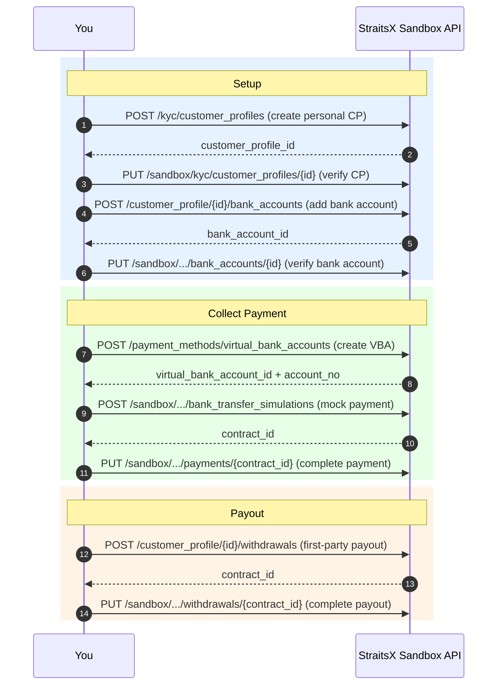
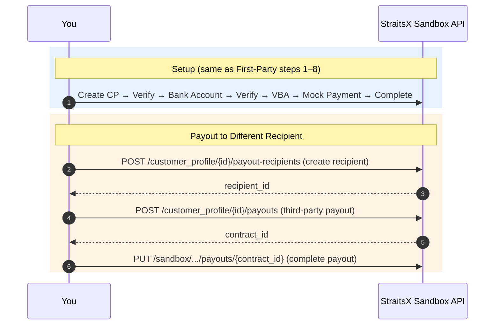
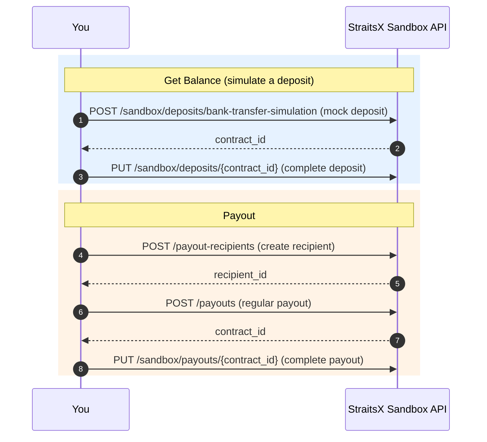

# StraitsX Sandbox Testing

## Invoke This Skill When

- User asks "How do I test the full flow?" or "Walk me through sandbox integration"
- User wants to try the API end-to-end in sandbox
- User asks about mock payments, simulating bank transfers, or testing payouts
- User is new to StraitsX and wants a working example
- User asks about testing webhooks/callbacks in sandbox
- User wants to verify callback signatures during sandbox testing

## Prerequisites

- Sandbox API key configured (see the `straitsx-auth-setup` skill)
- `X_XFERS_APP_API_KEY` environment variable set with a sandbox key — get it from the [StraitsX Dashboard](https://biz.straitsx.com) (Developer Tools section, in sandbox mode)
- (For webhook testing) `STRAITSX_SIGNING_SECRET` environment variable set with the signing secret from the [StraitsX Dashboard](https://biz.straitsx.com) (Platform Tools > Callback URLs > Signing Key Section)
- **Required permissions**: Your sandbox API key must have the necessary endpoint scopes enabled. If you receive `XFE6` (403 Access Denied) on any endpoint, contact StraitsX support at https://support.straitsx.com/hc/en-us/requests/new to request access. Sandbox keys may need explicit scope grants just like production keys.

## Step 1: Ask the User's Integration Model

Before generating code, ask which model they need:

| Model | Use case | What it covers |
|---|---|---|
| **First-Party** | Collect payment from a customer, pay out to the same bank account | CP → Bank Account → VBA → Mock Payment → First-Party Payout |
| **Third-Party** | Collect payment from a customer, pay out to a different recipient | CP → Bank Account → VBA → Mock Payment → Payout Recipient → Third-Party Payout |
| **Regular** | Send money from your business account to any recipient | VBA → Mock Payment → Payout Recipient → Regular Payout |

If the user doesn't specify, default to **First-Party** as it's the most common starting point.

## Step 2: Generate the Flow

Generate a complete, runnable script in the user's preferred language (default to Python if not specified). The script should be sequential — each step depends on the previous one.

### First-Party Flow


```mermaid
sequenceDiagram
    autonumber
    participant You
    participant API as StraitsX Sandbox API

    rect rgb(230, 242, 255)
    Note over You, API: Setup
    You->>API: POST /kyc/customer_profiles (create personal CP)
    API-->>You: customer_profile_id
    You->>API: PUT /sandbox/kyc/customer_profiles/{id} (verify CP)
    You->>API: POST /customer_profile/{id}/bank_accounts (add bank account)
    API-->>You: bank_account_id
    You->>API: PUT /sandbox/.../bank_accounts/{id} (verify bank account)
    end

    rect rgb(230, 255, 230)
    Note over You, API: Collect Payment
    You->>API: POST /payment_methods/virtual_bank_accounts (create VBA)
    API-->>You: virtual_bank_account_id + account_no
    You->>API: POST /sandbox/.../bank_transfer_simulations (mock payment)
    API-->>You: contract_id
    You->>API: PUT /sandbox/.../payments/{contract_id} (complete payment)
    end

    rect rgb(255, 243, 230)
    Note over You, API: Payout
    You->>API: POST /customer_profile/{id}/withdrawals (first-party payout)
    API-->>You: contract_id
    You->>API: PUT /sandbox/.../withdrawals/{contract_id} (complete payout)
    end
```

```
1. Create a personal customer profile
   POST /kyc/customer_profiles
   Body is FLAT (not nested under data.attributes). Required fields include:
   customerName, registrationType ("personal"), registrationIdType, registrationIdCountry,
   registrationId, countryOfResidence, dateOfBirth, nationality (ISO alpha-2 code, e.g. "SG"),
   address (object with street, city, postalCode, state, country).
   Note: address.street only allows letters, numbers, spaces, and / - ? : ( ) . , ' + (no # character).
   → Response format: JSON:API (data.id)
   → Response: CP ID at `data.id` (e.g., "customer_profile_a2a82920-...")

2. [Sandbox] Verify the customer profile
   PUT /sandbox/kyc/customer_profiles/{customer_profile_id}
   Body: { "data": { "attributes": { "verificationStatus": "verified" } } }
   → Response format: JSON:API (data.id)
   → Response: Same CP ID at `data.id`, updated `data.attributes.verificationStatus`

3. Create a customer profile bank account
   POST /customer_profile/{customer_profile_id}/bank_accounts
   Body is FLAT. Required fields: account_holder_name, account_no,
   bank_account_proof (object with fileUrl — use a direct image URL, e.g. "https://www.w3.org/Graphics/PNG/nurbcup2si.png").
   Either `bank` (e.g. "DBS") or `swift_bic` must be provided — use `bank` for SGD local transfers, `swift_bic` for USD/international transfers.
   Note: fileUrl must point to a directly accessible image (png/jpg/jpeg/pdf) without query parameters.
   → Response format: array ([0].id)
   → Response: Bank account ID at `[0].id` (integer, e.g., 26513). Note: response is an array, not an object.

4. [Sandbox] Verify the bank account
   PUT /sandbox/customer_profile/{customer_profile_id}/bank_accounts/{bank_account_id}?verification_status=verified
   This endpoint uses a query parameter, NOT a request body. No body needed.
   → Response format: flat
   → Response: Updated bank account object with `verification_status: "verified"`

5. Create a virtual bank account (VBA) for the customer profile
   POST /payment_methods/virtual_bank_accounts
   Body uses data.attributes + data.relationships (nested format).
   Required in data.attributes: referenceId (unique per request), currency ("SGD" or "USD").
   Required in data.relationships: `customerProfile` (camelCase, NOT `customer_profile`) with nested data.id = customer_profile_id.
   → Response format: JSON:API (data.id)
   → Response: VBA ID at `data.id`, account number at `data.attributes.instructions.accountNo`
   Note: SGD VBAs are enabled immediately on creation. USD VBAs require an additional
   sandbox verification step — see step 6.

6. [Sandbox] Enable the USD VBA (USD only — skip for SGD)
   PUT /sandbox/customer_profile/{customer_profile_id}/virtual_bank_accounts/{virtual_bank_account_id}
   Body is FLAT: { "status": "enabled" }
   → Response format: JSON:API (data.id)
   → Response: VBA with updated `data.attributes.status: "enabled"` and `data.attributes.instructions` populated

7. [Sandbox] Simulate a bank transfer payment to the VBA
   POST /sandbox/customer_profile/{customer_profile_id}/bank_transfer_simulations
   Body is FLAT. Required fields: destination_bank_account_no (the VBA account_no),
   amount, source_bank_account_holder_name.
   → Response format: flat (id) — NOT JSON:API
   → Response: Contract ID at `id` (e.g., "contract_fac6965b..."). Do NOT use `data.id`.

8. [Sandbox] Complete the mock payment
   PUT /sandbox/customer_profile/{customer_profile_id}/payments/{contract_id}
   Body: { "data": { "attributes": { "status": "completed" } } }
   → Response format: JSON:API (data.id)
   → Response: Contract ID at `data.id` (e.g., "contract_3b90b46511d5..."), updated `data.attributes.status`
   Note: The sandbox may auto-complete this payment within ~1 second. Check the payment
   status before calling this endpoint. If already completed, skip this step.

9. Create a first-party payout (withdraw to the same bank account)
   POST /customer_profile/{customer_profile_id}/withdrawals
   Body is FLAT. Required fields: bank_account_id, amount, idempotency_id (unique UUID).
   → Response format: nested flat (withdrawal_request.id)
   → Response: Contract ID at `withdrawal_request.id` (e.g., "contract_1b6b81cf...")

10. [Sandbox] Complete the mock payout
    PUT /sandbox/customer_profile/{customer_profile_id}/withdrawals/{contract_id}
    Body is FLAT: { "status": "completed" }
    → Response format: flat
    → Response: Updated payout object with `status: "completed"`
```

### First-Party Response Chain Map

| Step | Response Field | Feeds Into |
|------|---------------|------------|
| Step 1 (Create CP) | `data.id` | Steps 2–10 path param `customer_profile_id` |
| Step 3 (Create bank account) | `[0].id` (integer) | Step 4 path param `bank_account_id`, Step 9 body `bank_account_id` |
| Step 5 (Create VBA) | `data.id` | Step 6 path param `virtual_bank_account_id` (USD only) |
| Step 5 (Create VBA) | `data.attributes.instructions.accountNo` | Step 7 body `destination_bank_account_no` |
| Step 7 (Simulate payment) | `id` (flat, not `data.id`) | Step 8 path param `contract_id` |
| Step 9 (Create payout) | `withdrawal_request.id` | Step 10 path param `contract_id` |

### Third-Party Flow


```mermaid
sequenceDiagram
    autonumber
    participant You
    participant API as StraitsX Sandbox API

    rect rgb(230, 242, 255)
    Note over You, API: Setup (same as First-Party steps 1–8)
    You->>API: Create CP → Verify → Bank Account → Verify → VBA → Mock Payment → Complete
    end

    rect rgb(255, 243, 230)
    Note over You, API: Payout to Different Recipient
    You->>API: POST /customer_profile/{id}/payout-recipients (create recipient)
    API-->>You: recipient_id
    You->>API: POST /customer_profile/{id}/payouts (third-party payout)
    API-->>You: contract_id
    You->>API: PUT /sandbox/.../payouts/{contract_id} (complete payout)
    end
```

```
Steps 1–8: Same as First-Party Flow (see response annotations above)

9. Create a payout recipient for the customer profile
   POST /customer_profile/{customer_profile_id}/payout-recipients
   Body uses data.attributes (nested format). Required fields vary by disbursement method and currency.
   Recommended: Call GET /payout-recipients/requirements first
   to discover required fields for your specific disbursementMethod + currency combination.
   Common required fields: recipientCountry, recipientInformation.disbursementMethod,
   recipientInformation.recipientName, recipientInformation.currency, recipientInformation.entityType.
   Additional fields by method:
   - bankTransfer (SGD): + bankAccountNo, bankShortCode
   - paynow (SGD): + proxyType, proxyValue
   - swift (USD): + bankAccountNo, swiftBic, recipientAddress
   → Response format: JSON:API (data.id)
   → Response: Recipient ID at `data.id` (e.g., "payout_recipient_4b34a644-4b26-4e15-...")

10. Create a third-party payout
    POST /customer_profile/{customer_profile_id}/payouts
    Body uses data.attributes (nested format). Required fields: idempotencyId, amount,
    payoutRecipient.payoutRecipientId, payoutRecipient.disbursementMethod.
    → Response format: JSON:API (data.id)
    → Response: Contract ID at `data.id` (e.g., "contract_bd0b8014d2d5...")

11. [Sandbox] Complete the mock payout
    PUT /sandbox/customer_profile/{customer_profile_id}/payouts/{contract_id}
    Body: { "data": { "attributes": { "status": "completed" } } }
    → Response format: JSON:API (data.id)
    → Response: Same contract ID at `data.id`, updated `data.attributes.status`
```

### Third-Party Response Chain Map (steps 9–11 only; steps 1–8 same as First-Party)

| Step | Response Field | Feeds Into |
|------|---------------|------------|
| Step 9 (Create recipient) | `data.id` | Step 10 body `payoutRecipient.payoutRecipientId` |
| Step 10 (Create payout) | `data.id` | Step 11 path param `contract_id` |

### Regular Flow


```mermaid
sequenceDiagram
    autonumber
    participant You
    participant API as StraitsX Sandbox API

    rect rgb(230, 242, 255)
    Note over You, API: Get Balance (simulate a deposit)
    You->>API: POST /sandbox/deposits/bank-transfer-simulation (mock deposit)
    API-->>You: contract_id
    You->>API: PUT /sandbox/deposits/{contract_id} (complete deposit)
    end

    rect rgb(255, 243, 230)
    Note over You, API: Payout
    You->>API: POST /payout-recipients (create recipient)
    API-->>You: recipient_id
    You->>API: POST /payouts (regular payout)
    API-->>You: contract_id
    You->>API: PUT /sandbox/payouts/{contract_id} (complete payout)
    end
```

```
1. [Sandbox] Simulate a bank transfer deposit
   POST /sandbox/deposits/bank-transfer-simulation
   Body uses data.attributes (nested format). Required fields: amount.
   Optional: currency ("SGD" or "USD"), source_bank_account_holder_name, source_bank_swift_code,
   source_bank_account_no, transaction_remarks.
   → Response format: JSON:API (data.id)
   → Response: Contract ID at `data.id` (e.g., "contract_fac6965b..."), status will be `pending`

2. [Sandbox] Complete the mock deposit
   PUT /sandbox/deposits/{contract_id}
   Body: { "data": { "attributes": { "status": "completed" } } }
   → Response format: JSON:API (data.id)
   → Response: Contract ID at `data.id`, updated status

3. Create a payout recipient
   POST /payout-recipients
   Body uses data.attributes (nested format). Required fields vary by disbursement method and currency.
   Recommended: Call GET /payout-recipients/requirements first
   to discover required fields for your specific disbursementMethod + currency combination.
   Common required fields: recipientCountry, recipientInformation.disbursementMethod,
   recipientInformation.recipientName, recipientInformation.currency, recipientInformation.entityType.
   Additional fields by method:
   - bankTransfer (SGD): + bankAccountNo, bankShortCode
   - paynow (SGD): + proxyType, proxyValue
   - swift (USD): + bankAccountNo, swiftBic, recipientAddress
   → Response format: JSON:API (data.id)
   → Response: Recipient ID at `data.id` (e.g., "payout_recipient_4b34a644-...")

4. Create a regular payout
   POST /payouts
   Body uses data.attributes (nested format). Required fields: idempotencyId, amount,
   payoutRecipient.payoutRecipientId, payoutRecipient.disbursementMethod.
   → Response format: JSON:API (data.id)
   → Response: Contract ID at `data.id` (e.g., "contract_266fd6d1c428...")

5. [Sandbox] Complete the mock payout
   PUT /sandbox/payouts/{contract_id}
   Body: { "data": { "attributes": { "status": "completed" } } }
   → Response format: JSON:API (data.id)
   → Response: Same contract ID at `data.id`, updated `data.attributes.status`
```

### Regular Flow Response Chain Map

| Step | Response Field | Feeds Into |
|------|---------------|------------|
| Step 1 (Simulate deposit) | `data.id` | Step 2 path param `contract_id` |
| Step 3 (Create recipient) | `data.id` | Step 4 body `payoutRecipient.payoutRecipientId` |
| Step 4 (Create payout) | `data.id` | Step 5 path param `contract_id` |

## FX Payout (Optional Add-on)

If the user also wants to test FX payouts (sending IDR to Indonesia), this can be combined with any integration model above. FX payout is not a separate integration model — it's a capability that layers on top of existing flows.

For the FX-specific flow (recipient requirements → create recipient → create quote → create payout → simulate completion), follow the `straitsx-fx-payout-idr` skill.

**Prerequisites for FX payout testing:**
- Wallet funded with USD (use sandbox topup: `POST /v1/sandbox/merchant/topup` with `currency: "USD"`)
- If using `onBehalfOf` mode: a verified Customer Profile (covered in First-Party/Third-Party flows above)
- FX payout feature enabled on the sandbox account (contact StraitsX team if you receive 403 `XFE6`)

**Sandbox simulation for FX payouts:**
- Simulate payout completion: `PUT /v1/sandbox/fx/payouts/:id` with `{"data":{"attributes":{"status":"completed"}}}`
- Simulate payout failure: `PUT /v1/sandbox/fx/payouts/:id` with `{"data":{"attributes":{"status":"cancelled"}}}`

## Step 3: Webhook Integration (Optional but Recommended)

Ask the user if they want to include webhook/callback testing in their sandbox flow. In production, callbacks are the primary way to know when a transaction status changes — so testing them in sandbox is strongly recommended.

### 3a. Configure Webhook URLs

Before running the flow, register your webhook.site URL for the events relevant to the chosen integration model using `PATCH /webhooks`. The API auto-creates the webhook config if one doesn't exist yet, so this works for first-time setup too.

```
PATCH /webhooks
Body:
{
  "data": {
    "attributes": {
      "paymentStatusUpdated": "https://webhook.site/<your-unique-id>",
      "payoutStatusUpdated": "https://webhook.site/<your-unique-id>",
      "cpVerificationStatusUpdated": "https://webhook.site/<your-unique-id>",
      "cpbaVerificationStatusUpdated": "https://webhook.site/<your-unique-id>"
    }
  }
}
```

Alternatively, webhook URLs can also be configured via the [StraitsX Dashboard](https://biz.straitsx.com) under Platform Tools → Callback URLs.

Which events to configure per integration model:

| Event | First-Party | Third-Party | Regular | Description |
|---|---|---|---|---|
| `paymentStatusUpdated` | ✅ | ✅ | ✅ | Fires when a VBA/PayNow payment status changes |
| `userDepositStatusUpdated` | — | — | ✅ | Fires when a user deposit status changes |
| `payoutStatusUpdated` | ✅ | ✅ | ✅ | Fires when a payout/withdrawal status changes |
| `cpVerificationStatusUpdated` | ✅ | ✅ | — | Fires when a customer profile verification status changes |
| `cpbaVerificationStatusUpdated` | ✅ | ✅ | — | Fires when a CP bank account verification status changes |
| `virtualAccountStatusUpdated` | ✅ | ✅ | ✅ | Fires when a VBA is enabled/disabled |

### 3b. Set Up a Callback Receiver via webhook.site

Use [webhook.site](https://webhook.site) as the callback receiver — no code or infrastructure needed:

1. Open https://webhook.site — a unique URL is generated automatically (e.g., `https://webhook.site/abc-123-...`)
2. Copy the unique URL
3. Use it in the `PATCH /webhooks` call from step 3a (or paste it into the [StraitsX Dashboard](https://biz.straitsx.com) under Platform Tools → Callback URLs)
4. After running the flow, check webhook.site to inspect incoming callback payloads, headers (`Xfers-Signature`), and timing

### 3c. Callback Events During the Flow

When the sandbox flow runs, these callbacks fire at each step:

**First-Party / Third-Party Flow:**

| Flow step | Callback event fired |
|---|---|
| Verify customer profile (sandbox) | `cpVerificationStatusUpdated` |
| Verify bank account (sandbox) | `cpbaVerificationStatusUpdated` |
| Complete mock payment (sandbox) | `paymentStatusUpdated` |
| Complete mock payout (sandbox) | `payoutStatusUpdated` |

**Regular Flow:**

| Flow step | Callback event fired |
|---|---|
| Complete mock deposit (sandbox) | `userDepositStatusUpdated` |
| Complete mock payout (sandbox) | `payoutStatusUpdated` |

### 3d. Verify Callback Signatures

Every callback includes an `Xfers-Signature` header (HMAC-SHA256 hex digest). The generated code should verify it using the signing secret from the [StraitsX Dashboard](https://biz.straitsx.com).

For signature verification logic, defer to the `straitsx-webhook-verification` skill — do not generate cryptographic code from scratch.

**Required environment variable:** `STRAITSX_SIGNING_SECRET` (from [StraitsX Dashboard](https://biz.straitsx.com) > Platform Tools > Callback URLs > Signing Key Section)

### 3e. Resend Callbacks

If a callback was missed or the listener wasn't running, use the resend endpoint:

```
POST /webhooks/{contractId}/resend
```

Or for multiple contracts at once:

```
POST /webhooks/resend
Body: { "data": { "attributes": { "contractIds": ["contract_...", "contract_..."] } } }
```

Note: Resend is primarily a production feature but useful to mention for completeness.

## Code Generation Rules

1. **Always look up the endpoint** in the OpenAPI spec ([`references/openapi-spec.json`](references/openapi-spec.json)) for the exact request body schema, required fields, and parameter formats. **Do not assume `data.attributes` nesting** — many endpoints use flat request bodies. Check the spec for each endpoint.
2. **Use sandbox base URL**: `https://api-sandbox.straitsx.com/v1`
3. **Include the API key header**: `X-XFERS-APP-API-KEY` from environment variable.
4. **Chain responses**: Extract IDs from each response to use in the next request (e.g., `customer_profile_id` from step 1 feeds into step 2).
5. **Add status checks**: After each request, check the HTTP status and print the response. Stop on errors.
6. **Use realistic test data**: Generate plausible names, registration IDs, addresses — not placeholder strings. For `nationality` and country fields, use ISO alpha-2 codes (e.g. `"SG"`, not `"SINGAPOREAN"`). For `address.street`, only use allowed characters: letters, numbers, spaces, and `/ - ? : ( ) . , ' +` (no `#`).
7. **Add comments**: Explain what each step does and what to expect.
8. **Print a summary**: At the end, print a summary of all created resources with their IDs.
9. **Webhook setup (if requested)**: Prepend the flow with a `PATCH /webhooks` call to register the user's webhook.site URL for the relevant events.
10. **Callback verification**: When the user wants to verify signatures locally (beyond webhook.site inspection), defer to the `straitsx-webhook-verification` skill's golden code. Never roll custom crypto.
11. **Rate limiting**: Insert a short delay (200–300ms) between each API call to stay within the sandbox 5 TPS rate limit. Without delays, sequential requests will trigger `STXE-9000` (429 Too Many Requests).
12. **Handle re-runs gracefully**: Before creating any resource (customer profile, bank account, VBA), check if it already exists using the corresponding GET/list endpoint and reuse it if found. Most resources cannot be deleted. Use `GET /kyc/customer_profiles?filter[registration_id]=...` for CPs, `GET /customer_profile/{id}/bank_accounts` for bank accounts, and create VBAs with a new unique `referenceId` each run.
13. **Bank account proof**: When creating a CP bank account (`POST /customer_profile/{id}/bank_accounts`), include `bank_account_proof` with a `fileUrl` pointing to a directly accessible image (png/jpg/jpeg/pdf) without query parameters. For sandbox, use a simple public image URL like `"https://www.w3.org/Graphics/PNG/nurbcup2si.png"`.

## Sandbox-Specific Notes

| Note | Detail |
|---|---|
| Sandbox API key | Must be a sandbox key, not production. Get it from [StraitsX Dashboard](https://biz.straitsx.com) > Developer Tools in sandbox mode. |
| Mock payments | Sandbox payments don't move real money. Use the simulation endpoints to trigger payment events. |
| Verification | In sandbox, you manually set verification status via sandbox endpoints. In production, StraitsX handles verification. |
| Balance | In sandbox, collect a payment first (via VBA or PayNow mock) to get balance in your business account before testing payouts. |
| Callbacks | Sandbox sends real callbacks to your configured webhook URL. Use a tool like ngrok if testing locally. |
| Signing secret | Required for callback verification. Get it from [StraitsX Dashboard](https://biz.straitsx.com) > Platform Tools > Callback URLs > Signing Key Section. Store as `STRAITSX_SIGNING_SECRET` env var. |
| Callback retries | Failed callbacks are retried with increasing delays (polynomial backoff), up to 20 attempts. Return any 2xx status code from your listener to acknowledge receipt. |
| Rate limit | Sandbox enforces a 5 TPS (transactions per second) rate limit. Add a ~300ms delay between requests to avoid 429 errors. |
| Re-runs | Most resources (customer profiles, bank accounts) cannot be deleted. On re-runs, check if the resource already exists via the GET/list endpoint and reuse it instead of creating a duplicate. |
| Permissions | Sandbox API keys may need explicit scope grants. If you get `XFE6` (403), contact StraitsX support to request endpoint access. |

## Troubleshooting

| Symptom | Likely cause |
|---|---|
| `STXE-1000` on any request | Invalid or missing API key. Check `X_XFERS_APP_API_KEY` is set and is a sandbox key. |
| `XFE6` (403 Access Denied) | Your API key is missing required scopes. Contact StraitsX support at https://support.straitsx.com/hc/en-us/requests/new to request access to the relevant endpoints. Sandbox keys may need explicit scope grants. |
| `STXE-4000 Resource Object Not Verified` | Customer profile or bank account not verified. Run the sandbox verification step first. |
| `STXE-4000 Insufficient Balance` | Business account has no balance. Collect a payment first via VBA or PayNow mock flow. |
| `STXE-5000 Record Not Found` | Wrong ID passed. Check you're using the ID from the previous step's response. |
| `STXE-7000 Duplicated Idempotency Key` | Reusing an idempotency key. Generate a new UUID for each request. |
| `STXE-9000 Rate Limit Reached` (429) | Too many requests per second. The sandbox enforces a 5 TPS limit. Add a ~300ms delay between API calls. |
| `XFE16 Customer profile already exists` | A CP with the same `registrationId` already exists. Use `GET /kyc/customer_profiles?filter[registration_id]=...` to find and reuse it. |
| `XFE16 Customer profile bank account already exists` | A bank account with the same details already exists for this CP. Use `GET /customer_profile/{id}/bank_accounts` to find and reuse it. |
| `XFE16 Invalid file url provided` | The `bank_account_proof.fileUrl` is invalid. Use a direct URL to a png/jpg/jpeg/pdf file without query parameters. |
| Payout fails with "bank account not verified" | The CP bank account needs to be verified via sandbox endpoint before creating a payout. |
| `registrationType is missing` or similar field errors | The request body format is wrong. Check the OpenAPI spec — many endpoints use flat bodies, not `data.attributes` nesting. |
| `XFE16 Transaction not in pending status` on complete step | The sandbox may auto-complete some payments within ~1 second. Check the payment status before calling the complete endpoint. If already completed, skip the step. |
